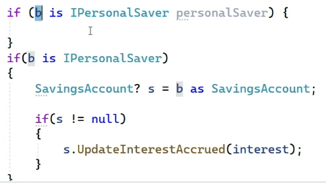

# Dependencies

## Simple Dependency
- Uses a relationship
## Association
- Has a relationship
## Aggregation
- Has many relationship
## Composition
- Is a relationship
- Empty arrow is 
## Generalization
- Uses a concrete implementation
- Empty arrow with a solid line
## Realization
- Implmentation from an interface usually
- Empty arrow with a dotted line
# Notes
- Use horizontal chaining more often
- Packages vs Namspaces
- Shorter syntax for casting
    - 
- Push on open paranthesis and pop on closed paranthesis