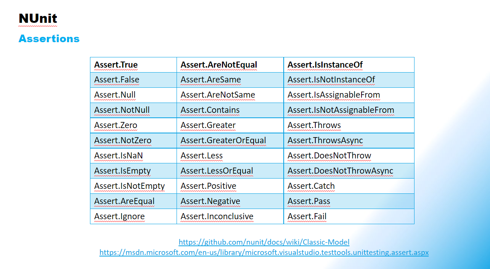
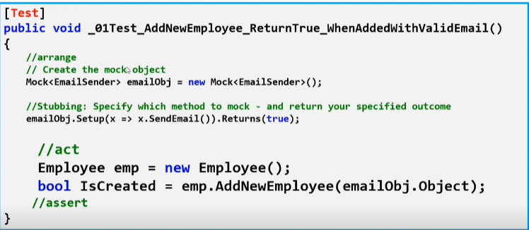
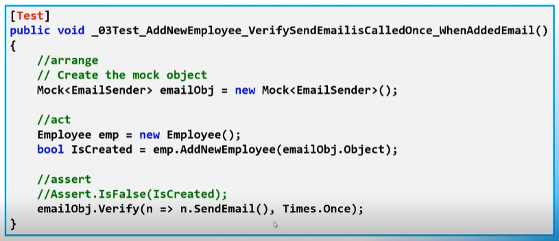
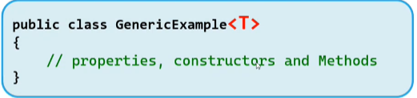
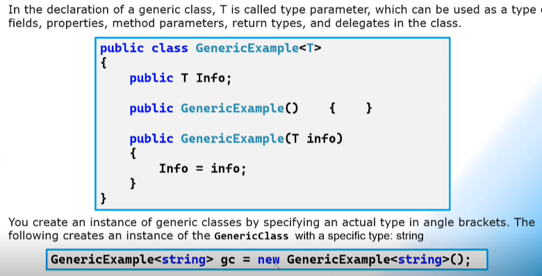
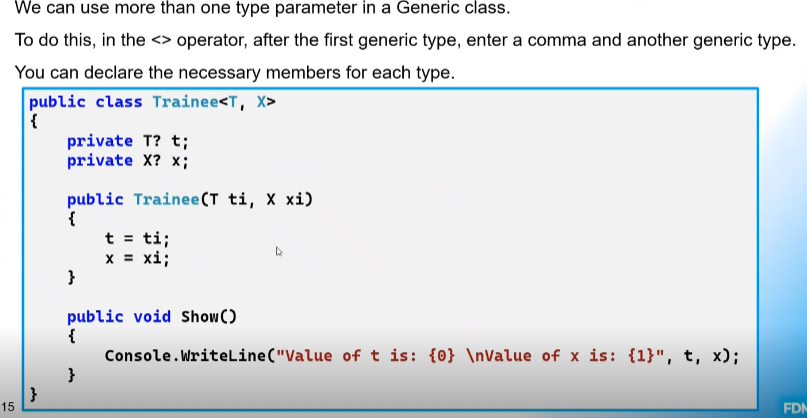

# Week 2 Notes
## TDD
- What are the 5 steps of TDD?
    1. Write the test
    2. Do just enough to make the test compile
    3. Watch it fail
    4. Do just enough to make the test pass
    5. Refactor and generalize
- What makes a good test?
    1. Focused - Tests only 1 thing
    2. Easy to read - Self documenting and clear
    3. Simple - No loops or decisions, only a sequence
    4. Independent - Should stand alone and have no dependencies
    5. Flexible - Can be re-used in different projects
- Three keys of tests
    - Arrange
    - Act
    - Assert
## NUnit
- What is NUnit?
    - Testing framework for all .NET languages
    - Needs the test adapterto give the platform to run NUnit
    - A nuget package
    - Like JUnit from Java
- How do you install packages for .NET?
    - First way:
        - Open the package manager console
            - View -> Other Windows -> Package Manager Console
            - For JUnit:
                - https://www.nuget.org/packages/NUnit/4.0.0-beta.1
    - Second way:
        - Nuget Package Manager
            - Right click on class library -> Manage NuGet Packages
- How do you uninstall packages for .NET?
    - Right click class library -> manage nuget packages -> installed -> uninstall.
- What do you need for testing in .NET?
    - NUnit
    - NUnit3TestAdapter
    - Microsoft.NET.Test.SDK
    - Moq
- Attributes
    - Same as annotations in Java
    - Key attributes in NUnit
        - [TestFixture]
            - Marks a class that contains tests with optional setup or teardown methods
        - [Test]
            - Mark a method inside a TestFixture class as a test
        - [TestCase(12, 3, 4)]
            - Serves the dual purpose of marking a method with parameters as a test method and providing inline data to be used when invoking that method.
        - [OneTimeSetUp]    
            - Performs prior to executing any of the tests in a fixture.
        - [OneTimeTearDown]
            - Performs after executing ALL tests in a fixture.
        - [SetUp]
            - Performs before each test method is called
        - [TearDown]
            - Performs after each test method is called
- Assertions
    - NUnit Assertions
        - https://docs.nunit.org/index.html
- Running a NUnit test
    - Test -> Run All Tests
- Ex: 
## Moq
- Why mock?
    - Test behavior and data
    - Test code units in isolation
    - Test void methods
    - Verify objects are interacting correctly
- What is a mock object?
    - Has all methods of the real object
    - Has state, set to default values for the data type.
    - Static methods and data are the same as the real object.
    - Invoking instance methods returns default vlaues
    - No code is invoked in the class when methods are called on the mock.
- What is stubbing?
    - Forces a mock to return a value of our choice instead of the default when calling a method.
- What is verification?
    - Checks that interactions occur as expected.
    - This is done after we use the mock.
- Creating a mock and stubbing:
    - Ex: 
- Creating a mock and verify:
    - Ex: 
## Generics
- What are generics?
    - Makes it possible to design general purpose classes, interfaces, abstract classes, fields, methods, static methods, properties, events, delegates, and operators.
    - Introduces the concept of type parameteres.
    - A placeholder for any data type that will be later specified.
- Why use generics?
    - Performance advantage because it removes the possibilities of boxing and unboxing.
    - Allows you to specify the type of object that another object should deal with in a dynamic way.
        - Ex: Lists can only deal with the object that's passed into the type parameter.
            - List<String> strings = new List<String>();
                - This list can only add strings
    - Compile-time safety.
- When would you use generics?
    - Create generic interfaces, classes, methods, events and delegates.
    - Generic classes may be constrained to enable acces to methods on particular data types.
    - Information on the types that are used in a generic data type may be obtained at run-time by using reflection
- Generic classes
    - Ex: 
        - T is just a variable. In C#, you can put whatever you want here, maybe with more info.
    - 
    - 