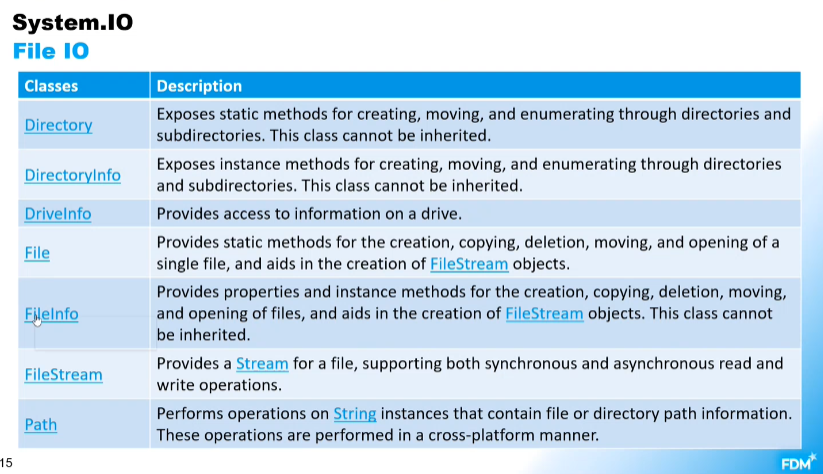

# Week 3 Notes
## Collections
- Collections Class
    - Provides functionality and methods that can be acted on a group of objects.
- Ordered Collections
    - Can iterate over the elements in a specific order.
- Unordered Collections
    - The elements have no relation to each other
- Sorted collections
    - Ordered collections may be sorted or unsorted
    - A sorted collections is ordered according to some rule imposed by the element content
        - It maintains its sorted state as elements are inserted and removed
    - An unsorted ordered collections is ordered in a way that has no relation to the element content
- Collections Nampespace
    - Systems.Collections Namspace contains interfaces and classes that define different collections of objects
- What does the collection interface inherit from?
    - The IEnumerable class
- What is the Collections interface?
    - The base interface for classes in the system.collections namespace.
    - Two key interfaces
        - IList
        - IDictionary
- IList
    - Represents a non generic collection of object that can be accessed by index
    - Ordered collection (sequence)
    - Defines methods to manipulate by position
- ISet
    - Interface for implementing sets
        - HashSet
            - Unordered
        - SortedSet
    - Sets are collections that have unique elements and specific operations
    - It does not have an index
    - Does not allow duplicates
    - Items within must obey the rule of equality
        - Check the hashcode, if it's equal, check the equality.
- Dictionary
    - Key value pairs
- Stack
    - Last in first out (Stack of plates, grab from the top)
    - Push - Inserts at top
    - Pop - Removes from top
        - Cannot pop empty stack
    - Peek - Check the top of stack without removing
- Queue
    - First in first out
    - Allows duplicates
    - Enqueue - Adds to the end of queue
    - Dequeue - Removes the oldest element
    - Peek
- LinkedList
    - Allows fast inserting and removing of elements
    - Elements are linked with each other using pointers
    - It is doubly linked, in that each node points forward to the next node and backwards to the previous node.
- Comparator
    - Ex: public class User : IComparable<User>
        - Implements the CompareTo method
            - This allows comparing based on defined values
                - Ex: Compare based on ID, less than, greater than and equal to.
                    - a - b or this.id - otheruser.id
- Comparer
    - Extension of another class
    - 
    - Example using strings:
        - 
## Exceptions
- What are exceptions?
    - An event that disrupts the normal flow of instructions during the execution of a program
        - Ex: Files not available
            - Network connection lost
            - Database server restarted
- What are errors?
    - Problems which cause the program to operate incorrectly.
- NUnit and Exceptions
    - 
## IO (Input/Output)
- File I/O
    - A file is a collection of data stored in a disk with a specific name and directory path.
    - Uses the System.IO namespace and has various classes that are used to read and write data to files.
- Streams
    - When a file is opneed for reading or writing, it becomes a stream
    - Input is used for reading
    - Output is used for writing
    - A generic view of a sequence of bytes
- Basic IO
    - 
- File IO
    - 